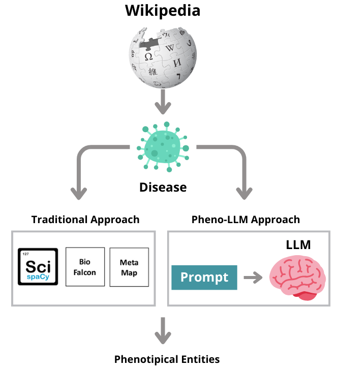
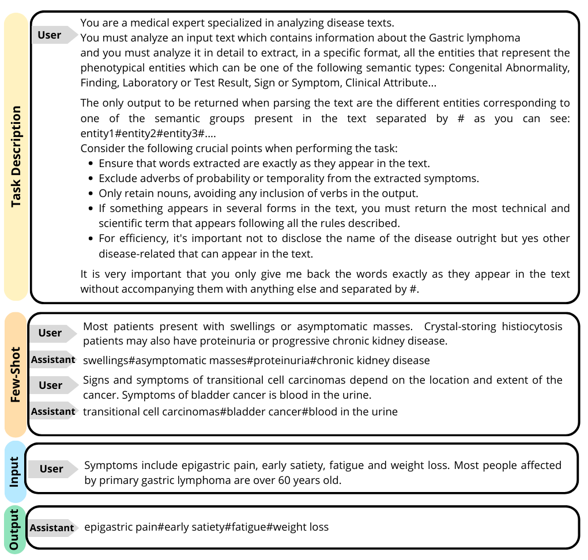

# Pheno-LLM

In the rapidly evolving field of biomedical text mining, extracting phenotypic entities from unstructured texts remains a pivotal challenge. This project introduces a novel method leveraging Large Language Models (LLMs) to tackle this challenge, particularly focusing on extracting phenotypical entities from freely available texts like Wikipedia. Unlike traditional Named Entity Recognition (NER) techniques, our approach utilizes both local and cloud-based LLMs to achieve superior performance.

<div style="text-align:center;">

</div>

**Methodology**: Our methodology involves a comprehensive comparison with state-of-the-art tools to demonstrate the efficacy of our approach. By leveraging LLMs, we surpass the limitations of conventional methods and enhance the identification of **relevant** phenotypic entities.

**Key Findings**:
Our study confirms the significant advantages of LLMs in identifying relevant phenotypic entities, thereby improving researchers' and clinicians' ability to understand and respond to disease dynamics more effectively.

**Implications**: This work underscores the potential of next-generation LLMs to redefine the standards for the extraction of phenotypic entities in biomedical research, paving the way for advancements in disease understanding and treatment.

**Keywords**

- Natural Language Processing (NLP)
- Information Extraction
- Large Language Models (LLMs)
- Disease Understanding


The data used for this project can be found [here](#data), the evaluation methodology is explained [here](#evaluation) and software requiriments in [here](#requirements).


## Data

The benchmark for evaluate the models can be found in [](https://doi.org/10.5281/zenodo.11184173)

## Evaluation

### LLMs


| Model Name                       | Size  | Purpose          | Description                                                                                                                                 |
|----------------------------------|-------|------------------|---------------------------------------------------------------------------------------------------------------------------------------------|
| meta-llama/Llama-2-7b-chat-hf    | 7B    | Chat             | General-purpose conversational model, optimized for engaging and coherent dialogues.                                                        |
| BioMistral/BioMistral-7B         | 7B    | Bio/Healthcare   | Specialized in biomedical and healthcare-related text processing and knowledge extraction.                                                  |
| mistralai/Mistral-7B-Instruct-v0.2 | 7B  | Instructive tasks | Designed for following specific instructions and generating informative content across various domains.                                     |
| OpenAI/GPT-3.5-Turbo             | Various | Multipurpose     | A more efficient and faster version of GPT-3, designed for real-time applications with improved performance and lower latency.              |
| OpenAI/GPT-4                     | Various | Multipurpose     | The next iteration of generative pre-trained transformers, featuring significant improvements in understanding and generating human-like text, capable of more nuanced comprehension and output. |


An example of a prompt can be found in : 
<div style="text-align:center;">


</div>

### Baselines

The baselines script can be foun in [link](./baselines.ipynb). 

| Tool          |     Model Name           |
|---------------------|-------------------|
| Falcon 2.0          | BioFalcon         |
| MetaMap             | MetaMap           |
| scispaCy            | en_core_sci_sm    | 
| scispaCy            | en_core_sci_md    | 
| scispaCy            | en_core_sci_lg    | 
| scispaCy            | en_core_sci_scibert 
| GliNER              | gliner_base       | 
| GliNER              | gliner_medium     | 
| GliNER              | gliner_large      |

## Requirements 

There are two environments to run the code: one for the baselines ([requirements](./req_baselines.txt)) and another for the LLMs ([requirements](./req_llms.txt)).

To install it execute:
```

pip install -r requirements.txt

```


## Acknowledgments

- This research is based on the paper [-](-), published in 

- If you find it useful you can cite it in:
```bibtext

```